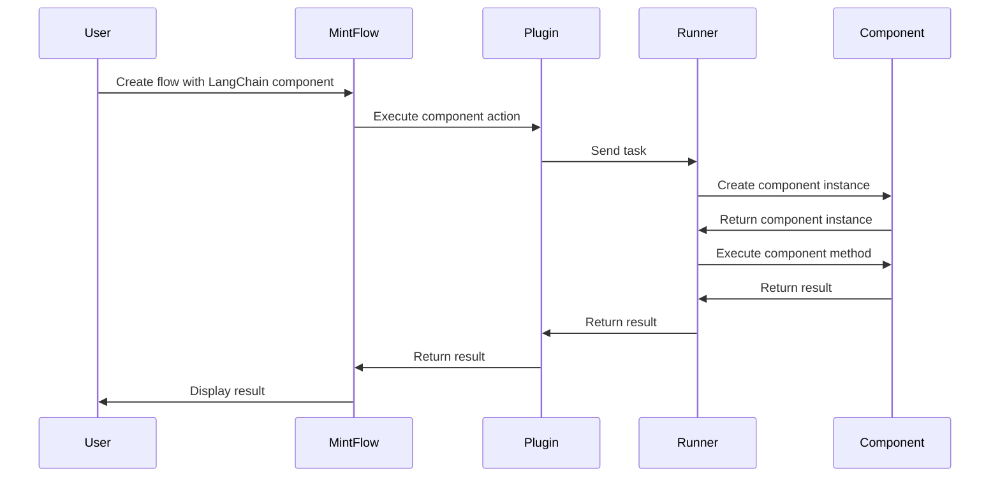
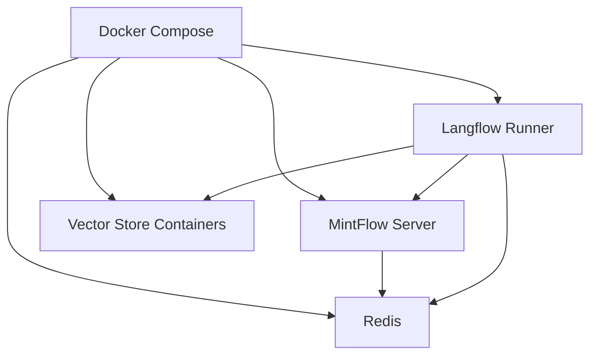

# LangChain Components Runtime Architecture

This document outlines the runtime architecture for LangChain components in MintFlow, focusing on how components are loaded, executed, and managed at runtime.

## Overview

The LangChain components runtime architecture is designed to provide a flexible, extensible, and efficient way to execute LangChain components in MintFlow. The architecture supports both JavaScript (LangChain.js) and Python (Langflow) implementations, allowing users to leverage the strengths of both ecosystems.

## Core Components

### 1. Component Registry

The Component Registry is a central repository for all LangChain components available in MintFlow. It provides:

- **Component Registration**: Register components with unique identifiers
- **Component Retrieval**: Retrieve components by identifier
- **Component Discovery**: Discover available components
- **Component Validation**: Validate component configurations

```typescript
// Component Registry Implementation
export class ComponentRegistry {
  private static instance: ComponentRegistry;
  private components: Map<string, ComponentFactory> = new Map();
  
  private constructor() {}
  
  static getInstance(): ComponentRegistry {
    if (!ComponentRegistry.instance) {
      ComponentRegistry.instance = new ComponentRegistry();
    }
    return ComponentRegistry.instance;
  }
  
  registerComponent(type: string, factory: ComponentFactory): void {
    this.components.set(type, factory);
  }
  
  getComponentFactory(type: string): ComponentFactory {
    const factory = this.components.get(type);
    if (!factory) {
      throw new Error(`Component type not registered: ${type}`);
    }
    return factory;
  }
  
  getRegisteredTypes(): string[] {
    return Array.from(this.components.keys());
  }
}
```

### 2. Component Factory

The Component Factory is responsible for creating instances of LangChain components. It provides:

- **Component Creation**: Create component instances with specific configurations
- **Configuration Validation**: Validate component configurations
- **Dependency Injection**: Inject dependencies into components

```typescript
// Component Factory Interface
export interface ComponentFactory<T = any> {
  create(config: any): T | Promise<T>;
}

// Example Implementation for Chroma Vector Store
export class ChromaFactory implements ComponentFactory<Chroma> {
  async create(config: {
    apiKey: string;
    namespace: string;
    url?: string;
    collectionName?: string;
  }): Promise<Chroma> {
    const embeddings = new OpenAIEmbeddings({
      openAIApiKey: config.apiKey
    });
    
    return new Chroma(embeddings, {
      url: config.url || "http://localhost:8000",
      collectionName: config.collectionName || config.namespace
    });
  }
}

// Example Implementation for Specialized Prompt Template
export class RAGPromptTemplateFactory implements ComponentFactory<any> {
  async create(config: {
    systemTemplate?: string;
    questionTemplate: string;
    contextTemplate?: string;
    includeSourceDocuments?: boolean;
    inputVariables?: string[];
    partialVariables?: Record<string, any>;
  }): Promise<any> {
    // Create a specialized prompt template for RAG workflows
    return {
      formatPrompt: async (values: Record<string, any>) => {
        // Format the prompt with the provided values
        // ...
      }
    };
  }
}
```

### 3. Runner System

The Runner System is responsible for executing LangChain components. It provides:

- **Task Execution**: Execute tasks on appropriate runners
- **Task Routing**: Route tasks to the appropriate runner
- **Result Handling**: Handle task results and errors

#### 3.1 Node Runner

The Node Runner executes JavaScript/TypeScript LangChain components. It provides:

- **JavaScript Execution**: Execute JavaScript/TypeScript code
- **LangChain.js Integration**: Integrate with LangChain.js
- **Node.js Environment**: Provide a Node.js environment for execution

#### 3.2 Python Runner

The Python Runner executes Python LangChain components. It provides:

- **Python Execution**: Execute Python code
- **Langflow Integration**: Integrate with Langflow
- **Python Environment**: Provide a Python environment for execution

```python
# Python Runner Implementation
def process_langflow_task(tenant_id: str, task_data: Dict[str, Any]):
    """
    Process a Langflow task.
    
    Args:
        tenant_id: Tenant ID
        task_data: Task data from Redis
    """
    flow_id = task_data.get("flowId")
    node_id = task_data.get("nodeId")
    component_type = task_data.get("componentType", "").lower()
    component_config = task_data.get("config", {})
    method_name = task_data.get("method", "build_vector_store")
    input_data = task_data.get("input", {})
    
    try:
        # Check if component is registered
        if component_type not in component_registry:
            raise ValueError(f"Unknown component type: {component_type}")
        
        # Get component class
        component_class = component_registry[component_type]
        
        # Convert config to Langflow format
        langflow_config = convert_mintflow_to_langflow_config(component_config)
        
        # Initialize component
        component = component_class(**langflow_config)
        
        # Set input data if needed
        if hasattr(component, "ingest_data") and "documents" in input_data:
            component.ingest_data = input_data["documents"]
        
        if hasattr(component, "search_query") and "query" in input_data:
            component.search_query = input_data["query"]
        
        # Execute method
        method = getattr(component, method_name)
        result = method()
        
        # Convert result to MintFlow format
        mintflow_result = convert_langflow_to_mintflow_result(result)
        
        # Notify flow engine
        notify_flowengine_completion(tenant_id, flow_id, node_id, mintflow_result)
    except Exception as e:
        error_msg = f"Error in Langflow task: {str(e)}\n{traceback.format_exc()}"
        logging.error(error_msg)
        notify_flowengine_failure(tenant_id, flow_id, node_id, str(e))
```

### 4. Plugin System

The Plugin System is responsible for integrating LangChain components with MintFlow. It provides:

- **Plugin Registration**: Register plugins with MintFlow
- **Plugin Configuration**: Configure plugins
- **Plugin Execution**: Execute plugin actions

```typescript
// Langflow Plugin Implementation
const langflowPlugin = {
  id: 'langflow',
  name: 'Langflow',
  icon: 'GiArtificialIntelligence',
  description: 'Integrates Langflow components for AI-heavy tasks',
  documentation: 'https://docs.langflow.org',
  runner: 'python',
  
  actions: [
    {
      name: 'createVectorStore',
      description: 'Create a vector store',
      execute: async function(input: any) {
        // This function will be executed by the Python runner
        return {
          componentType: input.componentType,
          method: 'build_vector_store',
          config: input.config,
          input: {
            documents: input.documents || []
          }
        };
      }
    },
    // Other actions...
  ]
};
```

## Runtime Flow

The runtime flow for LangChain components in MintFlow follows these steps:

1. **Component Registration**: Components are registered with the Component Registry during initialization.
2. **Flow Creation**: Users create flows that include LangChain components.
3. **Flow Execution**: MintFlow executes the flow, which includes LangChain components.
4. **Task Creation**: MintFlow creates tasks for each LangChain component in the flow.
5. **Task Routing**: Tasks are routed to the appropriate runner (Node or Python).
6. **Task Execution**: The runner executes the task using the appropriate component.
7. **Result Handling**: The runner returns the result to MintFlow, which continues the flow execution.



## Component Lifecycle

LangChain components in MintFlow follow this lifecycle:

1. **Registration**: Components are registered with the Component Registry.
2. **Configuration**: Components are configured with user-provided parameters.
3. **Initialization**: Component instances are created with the provided configuration.
4. **Execution**: Component methods are executed with the provided inputs.
5. **Result Handling**: Component results are returned to MintFlow.
6. **Cleanup**: Component resources are released when no longer needed.

## Memory Management

Memory management is a critical aspect of the LangChain components runtime architecture, especially for large language models and vector stores. The architecture provides:

- **Lazy Loading**: Components are loaded only when needed.
- **Resource Pooling**: Component instances are pooled and reused when possible.
- **Garbage Collection**: Component resources are released when no longer needed.
- **Memory Limits**: Memory limits are enforced to prevent out-of-memory errors.

## Error Handling

Error handling is a critical aspect of the LangChain components runtime architecture. The architecture provides:

- **Error Propagation**: Errors are propagated from components to MintFlow.
- **Error Recovery**: MintFlow can recover from component errors.
- **Error Logging**: Errors are logged for debugging.
- **Error Reporting**: Errors are reported to users.

```typescript
// Error Handling in Component Factory
export class ChromaFactory implements ComponentFactory<Chroma> {
  async create(config: {
    apiKey: string;
    namespace: string;
    url?: string;
    collectionName?: string;
  }): Promise<Chroma> {
    try {
      const embeddings = new OpenAIEmbeddings({
        openAIApiKey: config.apiKey
      });
      
      return new Chroma(embeddings, {
        url: config.url || "http://localhost:8000",
        collectionName: config.collectionName || config.namespace
      });
    } catch (error) {
      // Log error
      console.error(`Error creating Chroma vector store: ${error}`);
      
      // Rethrow with more context
      throw new Error(`Failed to create Chroma vector store: ${error.message}`);
    }
  }
}
```

## Performance Considerations

Performance is a critical aspect of the LangChain components runtime architecture. The architecture provides:

- **Caching**: Results are cached to avoid redundant computation.
- **Batching**: Operations are batched to reduce overhead.
- **Parallelization**: Operations are parallelized when possible.
- **Resource Limits**: Resource limits are enforced to prevent overload.

## Security Considerations

Security is a critical aspect of the LangChain components runtime architecture. The architecture provides:

- **Input Validation**: Component inputs are validated to prevent injection attacks.
- **Resource Isolation**: Components are isolated to prevent interference.
- **Access Control**: Component access is controlled to prevent unauthorized use.
- **Secrets Management**: Secrets are managed securely to prevent exposure.

## Deployment Architecture

The deployment architecture for LangChain components in MintFlow uses Docker containers for isolation and scalability:



### Container Configuration

- **MintFlow Server**: Runs the MintFlow Core and Plugin Layer
- **Redis**: Message broker for communication between components
- **Langflow Runner**: Executes Langflow components
- **Vector Store Containers**: Optional containers for vector stores (e.g., Chroma, Weaviate)

## Scaling Considerations

Scaling is a critical aspect of the LangChain components runtime architecture. The architecture provides:

- **Horizontal Scaling**: Multiple instances of runners can be deployed.
- **Vertical Scaling**: Runners can be allocated more resources.
- **Load Balancing**: Tasks are distributed across runners.
- **Auto-Scaling**: Runners can be scaled based on load.

## Monitoring and Observability

Monitoring and observability are critical aspects of the LangChain components runtime architecture. The architecture provides:

- **Logging**: Component operations are logged for debugging.
- **Metrics**: Component performance metrics are collected.
- **Tracing**: Component operations are traced for performance analysis.
- **Alerting**: Alerts are generated for component errors and performance issues.

## Conclusion

The LangChain components runtime architecture provides a flexible, extensible, and efficient way to execute LangChain components in MintFlow. By leveraging both JavaScript and Python implementations, users can take advantage of the strengths of both ecosystems to build powerful AI applications.
