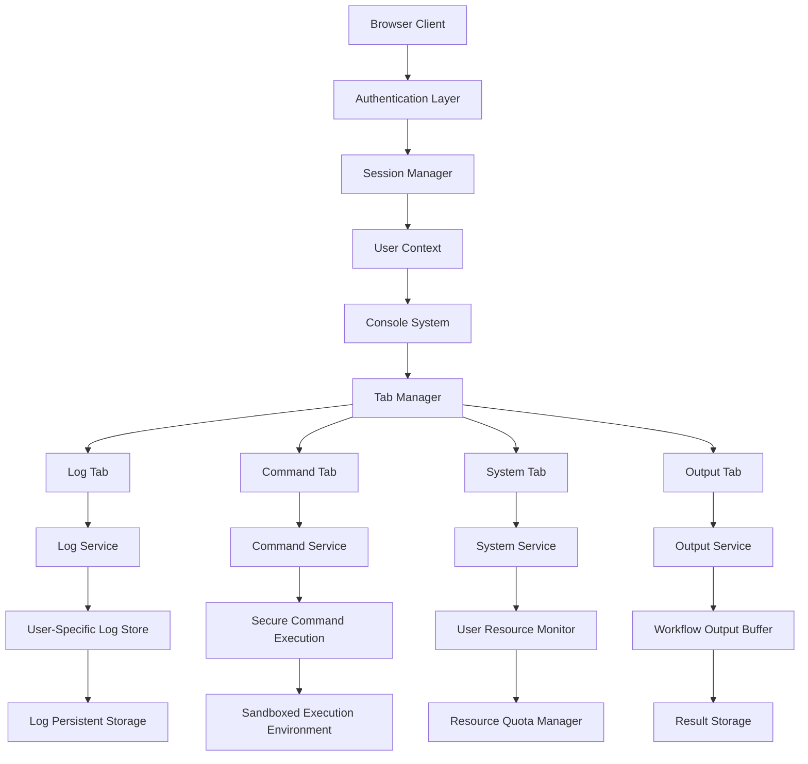
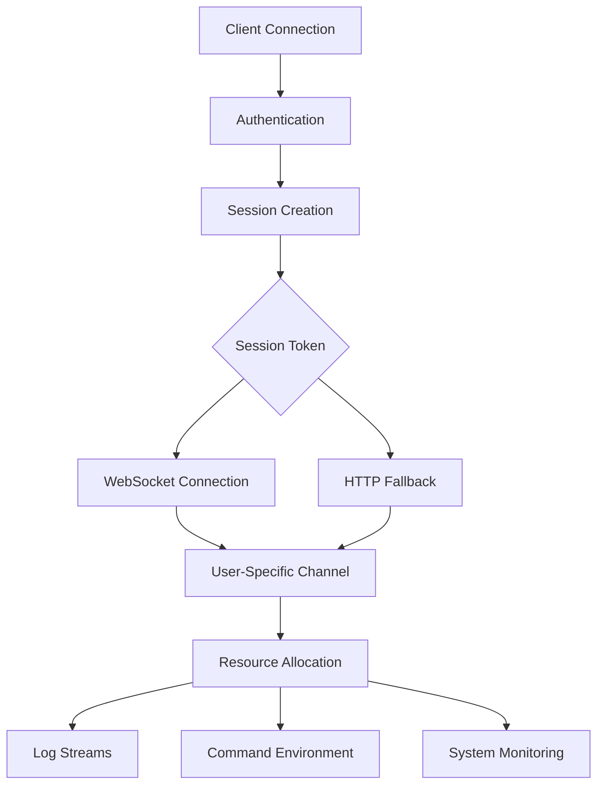
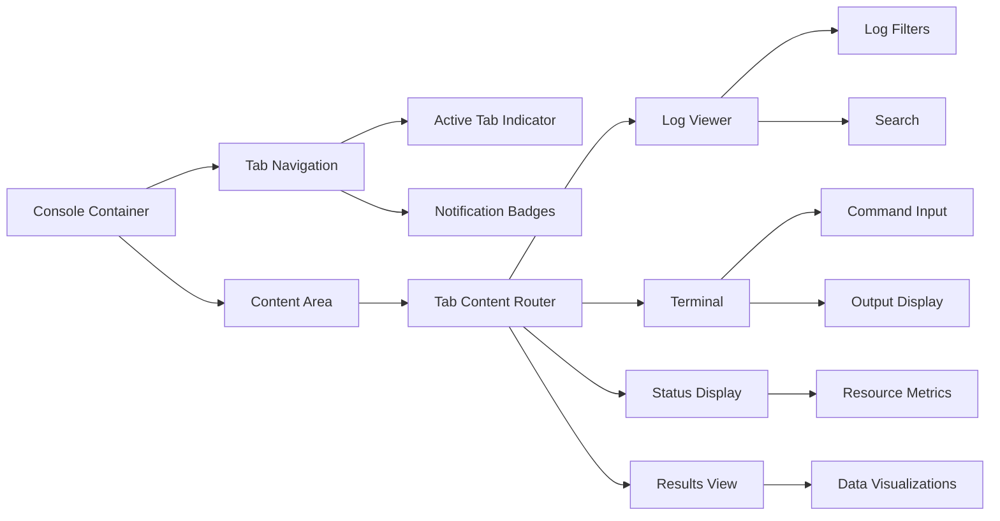
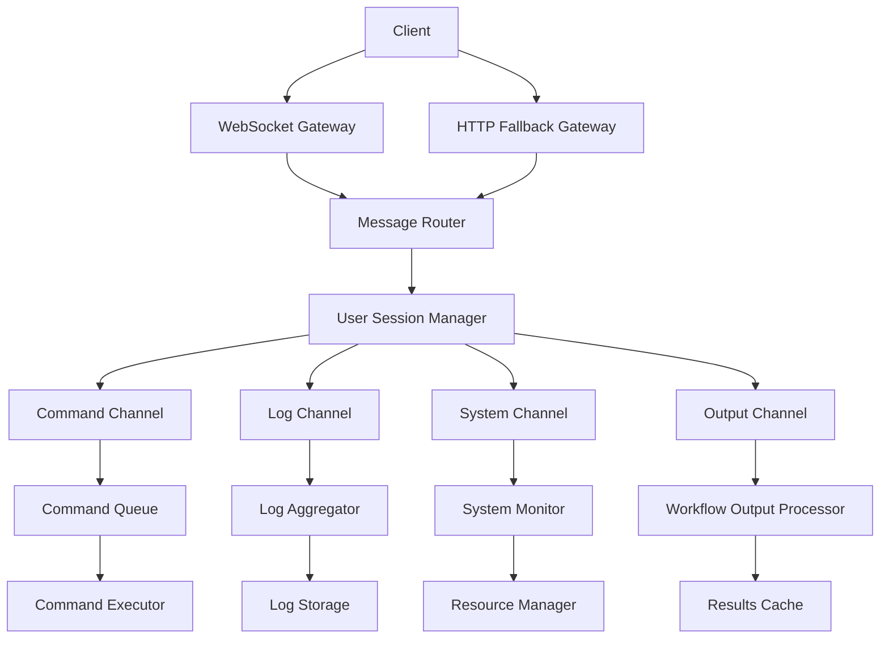
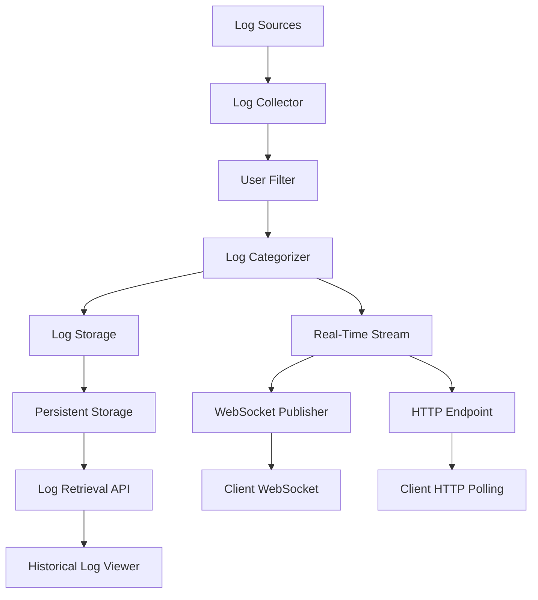
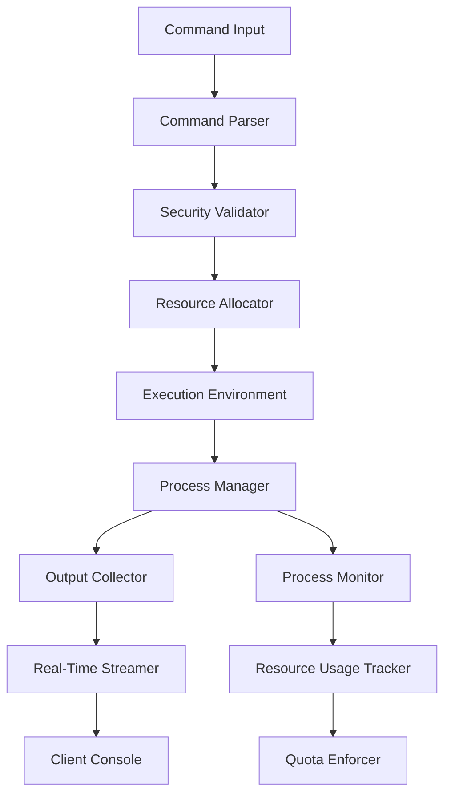

# Multi-Tenant Console System Architecture

## Overview

This document outlines the architecture for a multi-tab console system in the MintFlow workflow designer UI that supports multi-tenancy. The system allows users to view logs, run commands, and interact with the system while ensuring complete isolation between different users sharing the same server deployment.

## Core Requirements

1. **Multi-Tenancy Support**: Separate environments for each user despite sharing the same server deployment
2. **Real-Time Communication**: WebSocket-based communication with HTTP fallback
3. **Tab-Based Interface**: Separate tabs for logs, commands, system status, and output
4. **User Isolation**: Complete separation of data, logs, and processes between users
5. **Resource Management**: Prevent any single tenant from overloading the system

## System Architecture

## Component Details

### 1. Multi-Tenant Session Management

- **User Identification**: Each connection is authenticated and assigned a unique session ID
- **Session Tokens**: JWT or similar tokens that encode user identity and permissions
- **Connection Tracking**: Monitor active connections per user to manage resource allocation
- **Session Expiry**: Automatic cleanup of inactive sessions to free resources
- **Tenant Isolation**: Complete separation of data and processes between users

### 2. Multi-Tab Console Interface

- **Tab Management**: Allow users to customize tabs, save layouts
- **Cross-Tab Notifications**: Alert users of activity in non-active tabs
- **Responsive Layout**: Resize/collapse console to maximize workspace
- **Persistence**: Remember tab state between sessions for each user

### 3. Real-Time Communication System

- **WebSocket Connection Pool**: Manage connections efficiently with user-specific routing
- **Channel Isolation**: Separate communication channels for logs, commands, and system events
- **Message Queue**: Buffer messages for clients with connection issues
- **HTTP Fallback**: Alternative communication path when WebSockets aren't available

### 4. Log Management System

- **User-Specific Logging**: Each log entry is tagged with user/tenant ID
- **Log Filtering**: Server-side filtering to only send relevant logs to each user
- **Log Persistence**: Store logs for later retrieval with appropriate access controls
- **Log Streaming**: Real-time delivery of logs to active console sessions

### 5. Command Execution System

- **Sandboxed Execution**: Run commands in isolated environments
- **Resource Limits**: Enforce CPU, memory, and time limits per user
- **Command Validation**: Restrict available commands based on user permissions
- **Interactive Support**: Handle interactive commands that require user input

## Security Considerations

### 1. Authentication and Authorization

- **Strong Authentication**: Require secure authentication for all console access
- **Fine-grained Permissions**: Control what commands and resources each user can access
- **Token Validation**: Validate session tokens on every request
- **Activity Logging**: Log all command executions for audit purposes

### 2. Data Isolation

- **Strict Tenant Separation**: Ensure one user cannot access another's data or processes
- **Namespace Isolation**: Use separate namespaces for each user's resources
- **Data Encryption**: Encrypt sensitive data in transit and at rest
- **Session Isolation**: Prevent session hijacking or cross-session attacks

### 3. Resource Protection

- **Rate Limiting**: Prevent abuse through request rate limiting
- **Resource Quotas**: Allocate fair resource shares to each tenant
- **Monitoring**: Detect and respond to abnormal usage patterns
- **Graceful Degradation**: Maintain service for all users even under high load

## Implementation Phases

### Phase 1: Core Infrastructure

1. Set up WebSocket server with session management
2. Implement basic tab UI structure
3. Create user authentication and session tracking
4. Develop HTTP fallback mechanism

### Phase 2: Console Functionality

1. Implement log streaming and filtering
2. Develop command execution environment
3. Create system monitoring interface
4. Build workflow output display

### Phase 3: Multi-Tenancy Features

1. Implement tenant isolation
2. Add resource quotas and limits
3. Develop security validations
4. Create audit logging system

### Phase 4: Polish and Integration

1. Optimize performance for multiple concurrent users
2. Enhance UI with notifications and customization
3. Implement persistence for user preferences
4. Add advanced features like command history and autocompletion

## Technical Stack

- **Frontend**: React with xterm.js for terminal emulation
- **State Management**: Zustand for local state
- **Communication**: WebSockets with custom HTTP fallback
- **Backend**: Node.js with secure process execution
- **Authentication**: JWT-based session management
- **Storage**: User-partitioned data stores

## Conclusion

This architecture provides a secure, scalable foundation for a multi-tenant console system that allows users to view logs, run commands, and interact with the system while maintaining complete isolation between users. The tab-based interface offers a flexible, user-friendly experience, while the backend ensures security and resource fairness across all tenants.
