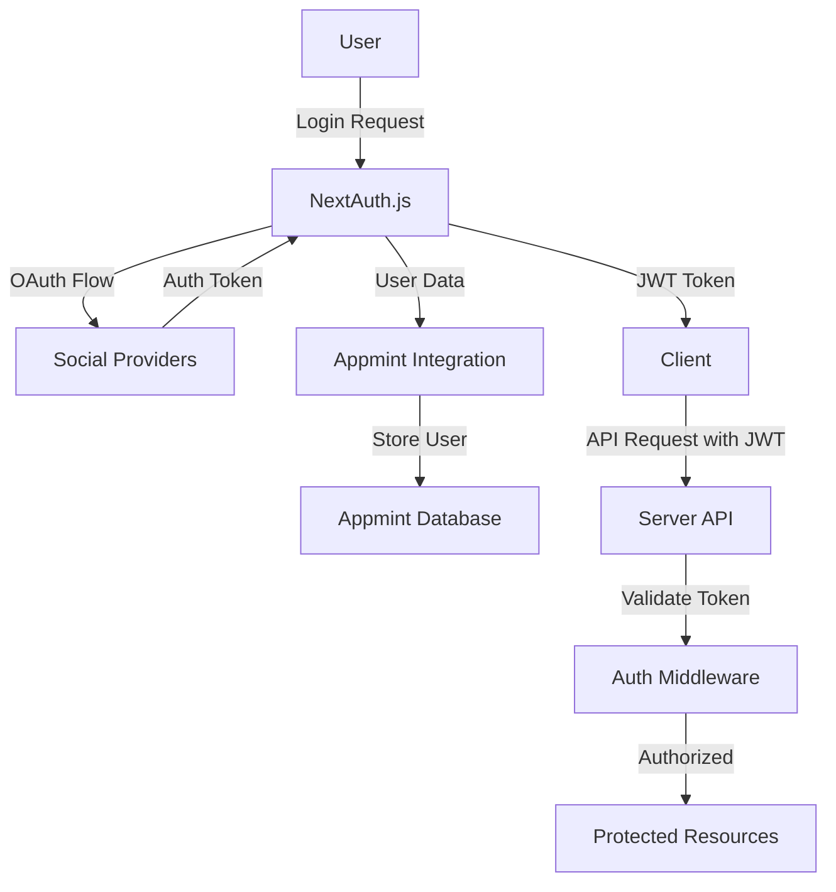

# MintFlow Social Authentication Documentation

## Overview

This document outlines the implementation of social authentication (Google, GitHub, and Facebook) in the MintFlow application. The authentication system uses NextAuth.js for handling OAuth flows and integrates with Appmint for user data storage.

## Architecture

The authentication system consists of the following components:

1. **NextAuth.js**: Handles OAuth flows with social providers
2. **Appmint Integration**: Stores user data after successful authentication
3. **JWT Authentication**: Secures API endpoints
4. **Middleware**: Protects routes requiring authentication



## OAuth Provider Setup

### Google OAuth

1. **Create OAuth Credentials**:
   - Go to [Google Cloud Console](https://console.cloud.google.com/)
   - Navigate to "APIs & Services" > "Credentials"
   - Create an OAuth 2.0 Client ID
   - Application type: Web application
   - Name: MintFlow App
   - Authorized JavaScript origins: `https://your-domain.com`
   - Authorized redirect URIs: `https://your-domain.com/api/auth/callback/google`

2. **Required Scopes**:
   - `https://www.googleapis.com/auth/userinfo.profile`
   - `https://www.googleapis.com/auth/userinfo.email`

### GitHub OAuth

1. **Create OAuth App**:
   - Go to [GitHub Developer Settings](https://github.com/settings/developers)
   - Click "New OAuth App"
   - Application name: MintFlow App
   - Homepage URL: `https://your-domain.com`
   - Authorization callback URL: `https://your-domain.com/api/auth/callback/github`

2. **Required Scopes**:
   - `user:email`
   - `read:user`

### Facebook OAuth

1. **Create Facebook App**:
   - Go to [Facebook for Developers](https://developers.facebook.com/)
   - Create a new app (Consumer type)
   - Add Facebook Login product
   - Set Valid OAuth Redirect URIs: `https://your-domain.com/api/auth/callback/facebook`

2. **Required Permissions**:
   - `email`
   - `public_profile`

## Environment Configuration

Create a `.env.local` file in the `ui-web` directory with the following variables:

```
# NextAuth.js
NEXTAUTH_URL=https://your-domain.com
NEXTAUTH_SECRET=your-secret-key

# OAuth Providers
GITHUB_ID=your-github-client-id
GITHUB_SECRET=your-github-client-secret

GOOGLE_ID=your-google-client-id
GOOGLE_SECRET=your-google-client-secret

FACEBOOK_ID=your-facebook-app-id
FACEBOOK_SECRET=your-facebook-app-secret

# Appmint Configuration
APPENGINE_ENDPOINT=your-appmint-endpoint
APP_ID=your-app-id
APP_KEY=your-app-key
APP_SECRET=your-app-secret
ORG_ID=your-org-id
SITE_NAME=your-site-name
DOMAIN_AS_ORG=true-or-false
```

## NextAuth.js Configuration

The NextAuth.js configuration is defined in `ui-web/src/app/(auth)/auth.ts`:

```typescript
export const { handlers, signIn, signOut, auth } = NextAuth({
  ...authConfig,
  providers: [
    GitHub({
      clientId: process.env.GITHUB_ID,
      clientSecret: process.env.GITHUB_SECRET,
    }),
    Google({
      clientId: process.env.GOOGLE_ID,
      clientSecret: process.env.GOOGLE_SECRET,
    }),
    Facebook({
      clientId: process.env.FACEBOOK_ID,
      clientSecret: process.env.FACEBOOK_SECRET,
    }),
    Credentials({
      // Existing credentials provider configuration
    }),
  ],
  callbacks: {
    // Callback implementations
  },
  pages: {
    signIn: '/auth/login',
  }
});
```

## Appmint Integration

The Appmint integration is handled by the `validateSocialLoginWithAppMint` function in `ui-web/src/lib/appmint-auth-integration.ts`:

```typescript
export async function validateSocialLoginWithAppMint(user: any): Promise<any> {
  try {
    // Check if user exists in AppMint
    const existingUser = await checkUserExistsInAppMint(user.email);

    if (existingUser && !existingUser.error) {
      // User exists, return the AppMint user data
      return {
        ...user,
        appmintUser: existingUser,
      };
    } else if (existingUser && existingUser.exists) {
      // User exists but we couldn't login
      return {
        ...user,
        appmintUserExists: true,
      };
    } else {
      // User doesn't exist, register them in AppMint
      const registeredUser = await registerUserInAppMint({
        email: user.email,
        name: user.name,
        image: user.image,
        // Include provider-specific data
        provider: user.provider,
        providerAccountId: user.id,
      });

      return {
        ...user,
        appmintUser: registeredUser,
      };
    }
  } catch (error) {
    console.error('Failed to validate social login with AppMint:', error);
    // Return the original user data if validation fails
    return user;
  }
}
```

## Server-Side Authentication

The server-side authentication is implemented in the following files:

1. **authMiddleware.ts**: Validates JWT tokens for protected routes
2. **app.ts**: Applies the authentication middleware to routes

```typescript
// authMiddleware.ts
export function authMiddleware(req: Request & { user: any }, res: Response, next: NextFunction) {
  const token = req.headers.authorization?.split(' ')[1];

  if (!token) {
    return res.status(401).json({ error: 'Unauthorized: No token provided' });
  }

  try {
    const decoded = jwt.verify(token, ENV.JWT_SECRET);
    req.user = decoded; // Attach decoded user info to the request
    next();
  } catch (error) {
    return res.status(403).json({ error: 'Forbidden: Invalid token' });
  }
}

// app.ts
app.use('/api/nodes', authMiddleware, nodeRouter);
app.use('/api/tenants', authMiddleware, tenantRouter);
// Other protected routes
```

## Authentication Flow

1. **User Initiates Login**:
   - User clicks on a social login button (Google, GitHub, or Facebook)
   - NextAuth.js redirects to the provider's authorization page

2. **OAuth Provider Authentication**:
   - User authenticates with the provider
   - Provider redirects back to the application with an authorization code

3. **Token Exchange**:
   - NextAuth.js exchanges the authorization code for an access token
   - Provider returns user profile information

4. **Appmint Integration**:
   - Application checks if the user exists in Appmint
   - If not, registers the user in Appmint
   - Stores the user's social provider details

5. **Session Creation**:
   - NextAuth.js creates a session for the user
   - JWT token is generated and stored in cookies

6. **Protected Route Access**:
   - User requests access to a protected route
   - JWT token is validated by the authMiddleware
   - If valid, the request proceeds; otherwise, returns 401/403

## Security Considerations

1. **Token Security**:
   - JWT tokens are signed with a secret key
   - Tokens have an expiration time
   - Refresh token mechanism for extended sessions

2. **OAuth Security**:
   - Use HTTPS for all OAuth redirects
   - Validate state parameter to prevent CSRF attacks
   - Store client secrets securely in environment variables

3. **API Security**:
   - All API routes are protected with authentication middleware
   - Rate limiting to prevent brute force attacks
   - CORS configuration to restrict access

## Testing

1. **Local Testing**:
   - Use `http://localhost:3000` as the redirect URI during development
   - Set up test accounts for each provider
   - Test the entire authentication flow

2. **Production Testing**:
   - Verify OAuth configurations with production URLs
   - Test with real user accounts
   - Monitor authentication logs for errors

## Troubleshooting

1. **OAuth Errors**:
   - Check redirect URI configuration
   - Verify client ID and secret
   - Ensure required scopes are configured

2. **JWT Errors**:
   - Verify JWT_SECRET is properly set
   - Check token expiration
   - Ensure token is properly passed in Authorization header

3. **Appmint Integration Errors**:
   - Check Appmint API credentials
   - Verify user registration process
   - Monitor Appmint API responses

## Deployment Checklist

1. Set up OAuth credentials for production environment
2. Configure environment variables in production
3. Update redirect URIs to production URLs
4. Test authentication flow in production
5. Monitor authentication logs for errors

## Implementation Steps

1. Set up OAuth credentials for each provider
2. Update NextAuth.js configuration
3. Enhance Appmint integration
4. Update server-side authentication
5. Test the entire flow
