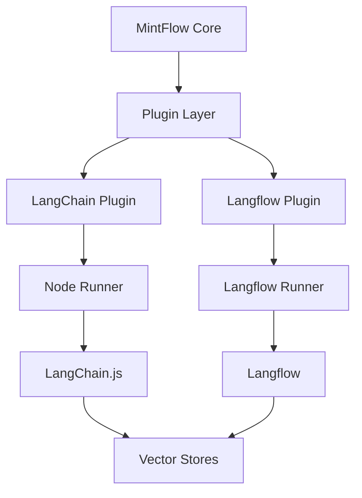
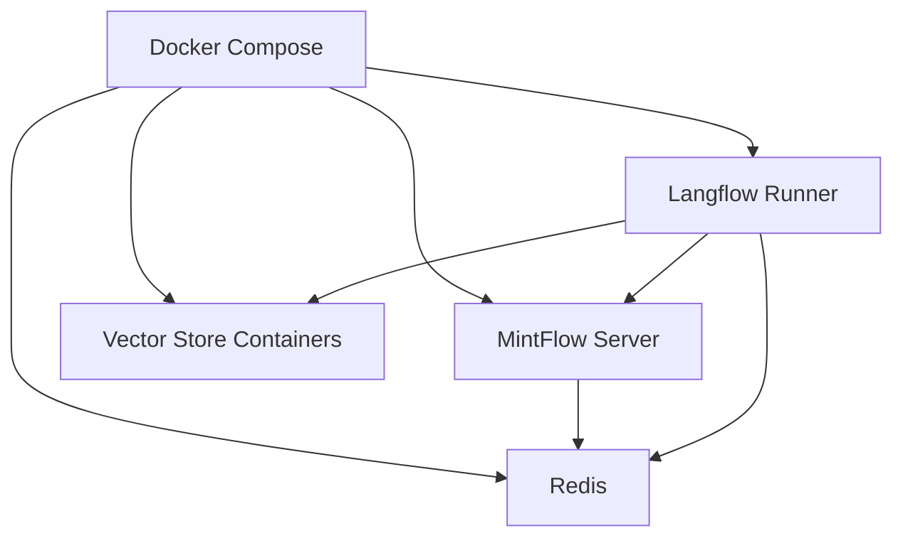
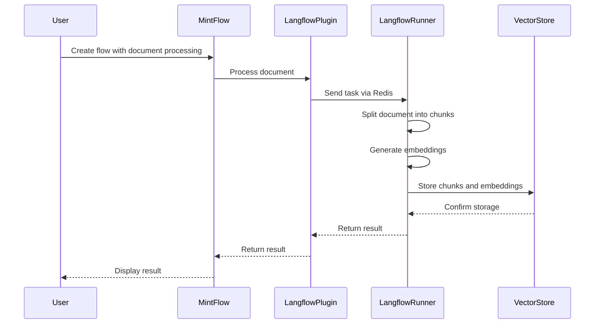
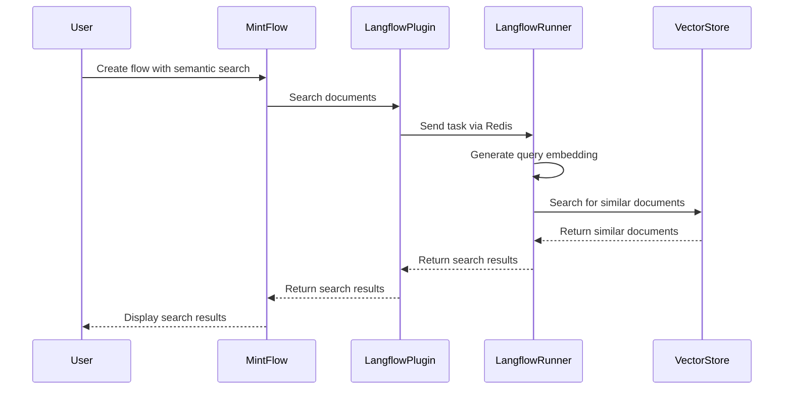

# Unified LangChain Ecosystem Integration

This document outlines the architecture and implementation details for integrating the LangChain ecosystem with MintFlow, focusing on the integration between Langflow and MintFlow for AI-heavy tasks.

## Architecture Overview

The integration architecture consists of several layers:

1. **MintFlow Core**: The main workflow engine that orchestrates the execution of flows
2. **Plugin Layer**: Plugins that extend MintFlow's capabilities
   - LangChain Plugin: Provides LangChain.js integration
   - Langflow Plugin: Provides Langflow (Python) integration
3. **Runner Layer**: Specialized runners for executing tasks
   - Node Runner: Executes JavaScript/TypeScript tasks
   - Python Runner: Executes Python tasks
   - Langflow Runner: Executes Langflow components
4. **Storage Layer**: Persistent storage for vector data
   - Vector Stores: Chroma, FAISS, Pinecone, etc.

## Component Interaction

### Data Flow

1. User creates a flow in MintFlow that includes LangChain or Langflow nodes
2. MintFlow Core processes the flow and identifies the appropriate runner for each node
3. For Langflow nodes, the task is sent to the Langflow Runner via Redis
4. The Langflow Runner executes the task using Langflow components
5. Results are returned to MintFlow Core via HTTP
6. MintFlow Core continues the flow execution with the results

## Implementation Details

### 1. MintFlow LangChain Plugin

The LangChain Plugin provides integration with LangChain.js, allowing users to use LangChain components directly in MintFlow flows.

Key features:
- Vector store factories for creating and managing vector stores
- Component registry for dynamically registering and retrieving components
- RAG plugin for retrieval-augmented generation workflows
- Specialized prompt templates for various use cases:
  - RAGPromptTemplate for retrieval-augmented generation
  - AgentPromptTemplate for agent-based workflows
  - StructuredPromptTemplate for generating structured outputs

### 2. MintFlow Langflow Plugin

The Langflow Plugin provides integration with Langflow (Python), allowing users to use Langflow components in MintFlow flows.

Key features:
- Vector store creation and management
- Document processing and embedding generation
- Semantic search using vector similarity

### 3. Langflow Runner

The Langflow Runner is a specialized Python runner that executes Langflow components.

Key features:
- Dynamic component loading and initialization
- Task processing from Redis queues
- Result formatting and return to MintFlow Core

### 4. Vector Store Integration

Both LangChain.js and Langflow provide integration with various vector stores:

| Vector Store | LangChain.js | Langflow |
|--------------|--------------|----------|
| Chroma       | ✅           | ✅       |
| FAISS        | ✅           | ✅       |
| Pinecone     | ✅           | ✅       |
| Qdrant       | ✅           | ✅       |
| Weaviate     | ✅           | ✅       |
| Redis        | ✅           | ✅       |
| Milvus       | ✅           | ✅       |

## Deployment Architecture

The deployment architecture uses Docker containers for each component:

### Container Configuration

- **MintFlow Server**: Runs the MintFlow Core and Plugin Layer
- **Redis**: Message broker for communication between components
- **Langflow Runner**: Executes Langflow components
- **Vector Store Containers**: Optional containers for vector stores (e.g., Chroma, Weaviate)

## Use Cases

### 1. Document Processing and Retrieval

### 2. Semantic Search

## Performance Considerations

### 1. Embedding Generation

Embedding generation can be computationally expensive. The architecture addresses this by:
- Batching document chunks for embedding generation
- Caching embeddings to avoid regeneration
- Using optimized embedding models

### 2. Vector Search

Vector search performance depends on the vector store used. The architecture supports:
- In-memory vector stores (FAISS) for fast search
- Distributed vector stores (Pinecone, Qdrant) for scalability
- Hybrid search combining vector similarity and keyword matching

### 3. Communication Overhead

Communication between MintFlow and the Langflow Runner introduces overhead. This is minimized by:
- Using Redis for efficient message passing
- Batching documents when possible
- Returning only necessary data in results

## Security Considerations

### 1. Code Execution

The Langflow Runner executes Python code, which introduces security risks. These are mitigated by:
- Running the runner in a Docker container with limited permissions
- Validating input data before execution
- Limiting available Python modules

### 2. API Keys

Vector stores and embedding models often require API keys. These are secured by:
- Storing keys in environment variables
- Not exposing keys in logs or results
- Using separate keys for different tenants

## Future Enhancements

1. **Additional Langflow Components**: Integrate more Langflow components beyond vector stores
2. **Streaming Results**: Support streaming results for long-running tasks
3. **Distributed Processing**: Scale the Langflow Runner horizontally for high-throughput workloads
4. **Monitoring and Observability**: Add detailed logging and metrics for performance monitoring
5. **Fault Tolerance**: Implement retry mechanisms and circuit breakers for resilience

## Conclusion

The integration between MintFlow and Langflow provides a powerful platform for AI-heavy tasks, combining the workflow orchestration capabilities of MintFlow with the extensive component library of Langflow. This architecture enables users to build complex AI workflows that leverage the best of both JavaScript and Python ecosystems.
